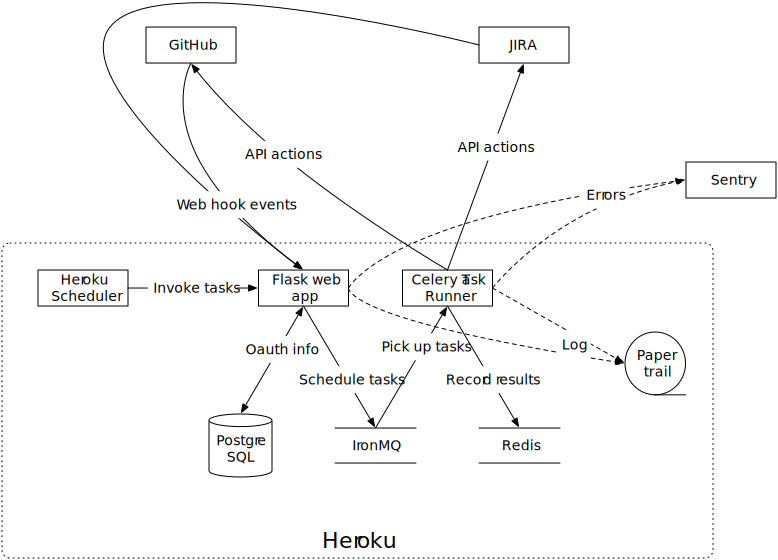

<!--
Title: `openedx-webhooks` Technical Information
Print Footer Left: %title
Print Footer Right: %page of %total ● %date, %time

-->

# `openedx-webhooks` Technical Information

**Prerequisite:** This document assumes you've read through [the current
documentation][docs] already.

## Infrastructure

This project depends on the following infrastructure components:

* Flask web app
* Celery task runner
* PostgreSQL
* IronMQ
* Redis
* Papertrail
* Sentry
* Heroku Scheduler
* GitHub
* JIRA

And here's how they all fit together:

## Issues With Current Codebase

### Too Many Responsibilities

This codebase currently [handles more than just web hook
events][responsibilities] from GitHub and JIRA. This makes it difficult to
define boundaries at the package, module, and function levels.

### Tight Coupling

For some reason the Flask app and Celery task runner are tightly coupled—one
cannot start without knowledge of the other. Also the task runner's
authentication to GitHub and JIRA is dependent on authentication through the
Flask app.

### Duplicate Knowledge

There are many functions that contain the business logic to handle the
orchestration, as well as how to perform the actions. The logic is spread among
Flask views and Celery tasks. This leads to:

* Leaky boundaries
* Everyone must have intimate knowledge of business logic, and how to parse
  event paylods, for example.
* Makes unit testing very difficult.

### Not Invented Here

We're not taking advantage of third party GitHub API client, JIRA API client,
and OAuth flow (if it's even needed!).

[docs]: http://openedx-webhooks.readthedocs.io/en/latest/
[responsibilities]: http://openedx-webhooks.readthedocs.io/en/latest/about.html
